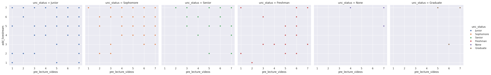
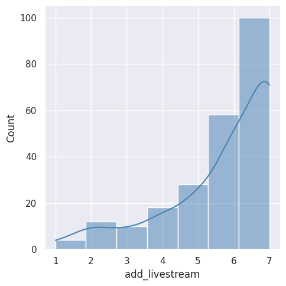
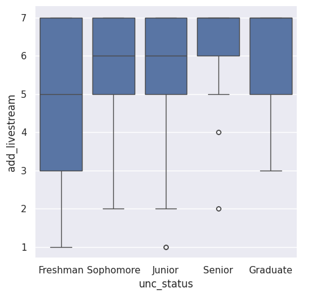

---
# Do not edit the text between these lines!
layout: default
---

# Analysis Summary

## We investigated if students would prefer if COMP 110 had access to livestreamed videos, and if those preferences had a strong correlation for pre-lecture videos.

Our analysis evaluated the feasibility of adding livestreams and pre-lecture videos to COMP 110 by cleaning and analyzing survey data from two sources to test the hypothesis that these additions would increase course accessibility for students. Through a combination of scatterplots, histograms, and boxplots, we identified a strong, cross-year student preference for livestream access and a positive correlation between interest in pre-lecture videos and livestreaming. We concluded that the data supports implementing these features, while also highlighting the necessary trade-offs, specifically the increased instructor workload and the technical infrastructure required for reliable streaming and storage.

# Scatterplots

<!-- This is a comment. Below, you'll see code for inserting an image. To make this image appear, update <custom-path>. To add an image, save it inside the imgs folder of this repository. -->

## Scatterplots comparing correllation between livestreaming class and pre-lecture class preference, seperated by grade level.

These scatter plots reveal the relationship between the preference strength for the addition of pre-lecture videos versus the preference strength of adding a livestream option to the class, with both axes ranging from 1 to 7. The data is seperated by class status; allowing for a deeper analysis of different groups. The "Senior," "Sophomore," "Freshman," and "Junior" categories display a high density of data points distributed across the entire 1–7 scale, indicating a wide variety of engagement behaviors among these student populations. In contrast, the "None" and "Graduate" panels show significantly fewer data points, suggesting that these groups represent much smaller samples within the dataset.

# Histogram

<!-- This is a comment. Below, you'll see code for inserting an image. To make this image appear, update <custom-path>. To add an image, save it inside the imgs folder of this repository. -->

## Histogram showing preference levels of adding a livestreamed class option. 1 being low preference and 7 being high preference.

This histogram shows the frequency distribution of add_livestream preference strength. The data displays an upward trend, showing that user votes increases as the values rise from 1 to 7, with a notable peak at the value of 7, which has approximately 300 occurrences-- meaning that students have a high preference for being able to access lecture via livestream.

# Boxplot

<!-- This is a comment. Below, you'll see code for inserting an image. To make this image appear, update <custom-path>. To add an image, save it inside the imgs folder of this repository. -->

## Boxplots showing the distribution of preference ratings for the implementation of livestreaming classes, seperated by grade level. 1 being low preference and 7 being high preference.

This boxplot compares the distribution of add_livestream activity across different class stuatuses. Sophomores, Juniors, and Seniors show the highest median engagement at 6, while Freshmen have a lower median of 5. Most groups display an upward-skewed distribution, with occasional low-end outliers for Sophomores and Seniors, while the Graduate category demonstrates a more compact range towards high preference for livestreamed lectures.

# Conclusions

## According to our analysis, we believe the course should offer livestreams of lectures, and pre-lecture videos if possible.

According to our data analysis, our idea that the course should offer livestreams of lectures is supported. The histogram of add_livestream responses shows a skew towards the highest rating, suggesting that the majority of COMP 110 students would prefer having access to a livestream option of the class. The boxplot continues this trend, and shows that having livestream access is preferred across all class years, each having a median of at least 6. Finally, the scatterplot shows that there is a positive relationship between preference for pre-lecture videos and livestreaming, meaning that students would value and utilize both options if provided.

To further investigate this idea, we can survey students and ask them if they would prefer interactive livestreams or videos posted after class. Stakeholders that could be negatively impacted if video-based learning is implemented are instructors because they would have an increased workload to manage the livestream and creating and posting pre-lecture videos. Some of the cost trade-offs are the need for technology strong and fast enough to produce reliable streaming and storage to hold recorded sessions and pre-lecture videos. 